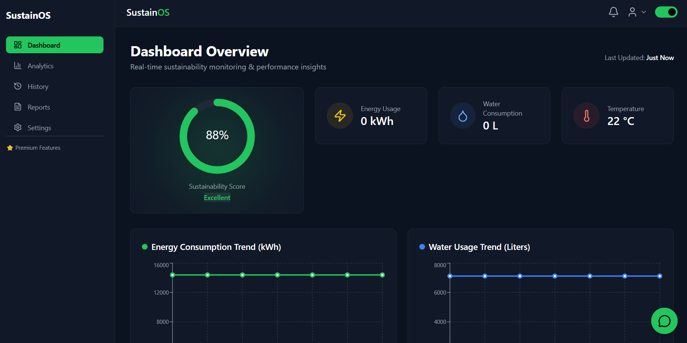
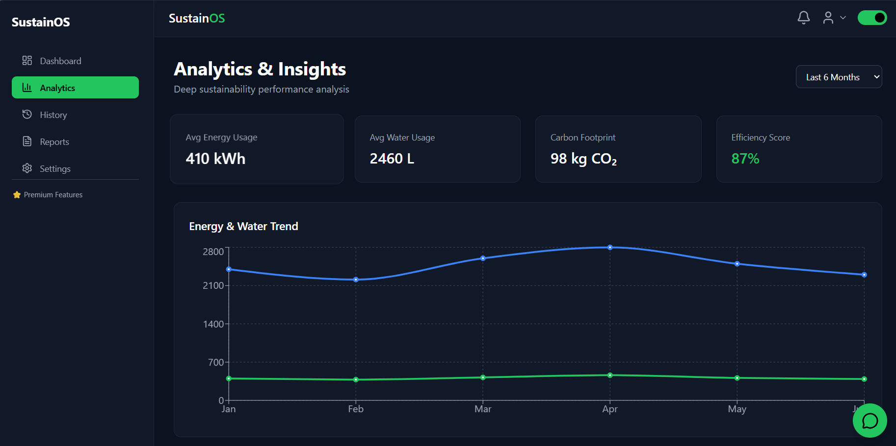
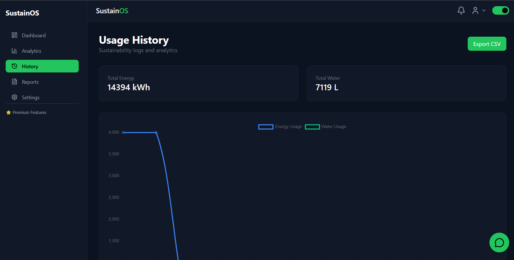
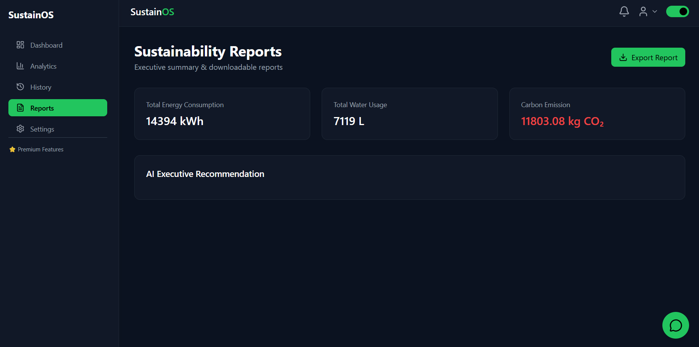
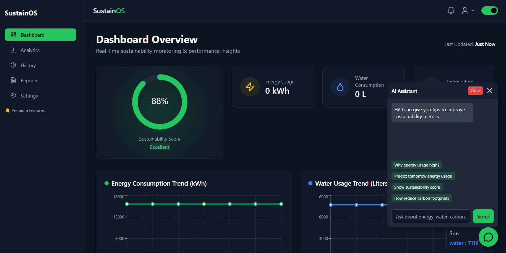

# SustainOS AI


SustainOS AI is a full-stack sustainability intelligence platform for smart buildings and campuses. It collects water and energy telemetry, detects anomalies, generates alerts, estimates sustainability impact, forecasts future usage, and explains everything through a conversational AI copilot.

## Why this project exists

Buildings often waste water and electricity because monitoring is fragmented, reactive, and hard for non-technical teams to interpret. SustainOS AI turns raw telemetry into actionable decisions:

- Monitor building-level telemetry in real time
- Detect abnormal spikes and likely leakage or load issues
- Estimate sustainability score, carbon impact, and savings potential
- Forecast upcoming usage with a Python ML service
- Explain insights in natural language through an AI assistant

## What the project can do

- Real-time dashboard for energy, water, alerts, reports, analytics, and history
- Protected user flows for login, profile, notifications, and settings
- Voice-friendly AI assistant with chat, telemetry draft mode, and profile draft mode
- Anomaly detection with alert generation and notification fanout
- Building benchmarking, root-cause hints, and next-best-action recommendations
- Forecasting and insight generation from a local Python ML microservice
- Optional Ollama / OpenAI / Gemini conversational enhancement
- Degraded fallback mode when database or external AI is unavailable

## 5-layer architecture

### 1. Frontend Layer

The frontend is a React + Vite + Tailwind application inside `Client/`. It contains:

- `src/pages/`: dashboard, analytics, reports, alerts, sensors, profile, settings, etc.
- `src/components/`: layout, charts, cards, chat widget, and dashboard modules
- `src/routes/`: protected and public route wiring
- `src/context/`: auth and theme state
- `src/utils/`: API, auth token, socket, and UI helpers

The frontend is responsible for:

- User authentication and navigation
- Visualizing telemetry and insights
- Showing alerts, reports, and recommendations
- Running the chat assistant UI
- Receiving live updates via Socket.IO

### 2. API Layer

The backend lives in `server/` and is built with Node.js + Express.

- `app.js` wires all REST routes and middleware
- `server.js` starts HTTP + Socket.IO and warms local AI when configured
- `routes/` exposes APIs for data, alerts, analytics, reports, auth, AI, sensors, notifications, and settings
- `controllers/` contain request orchestration logic

The API layer handles:

- Request validation and auth
- Data ingestion and history retrieval
- Alert and notification creation
- Report and analytics endpoints
- Chat and forecast endpoints

### 3. Data Layer

MongoDB stores the operational data model:

- `Data`: building telemetry such as water, energy, sensor metadata, and location
- `Alert`: anomaly and operational warnings
- `Notification`: in-app notifications
- `ConversationMemory`: user chat memory and preferences
- `User`, `UserSettings`, `SensorDevice`, and other support models

This layer provides persistent history so the system can compare recent readings with past behavior.

### 4. Intelligence Layer

The Node service contains local decision logic in `server/ai/` and `server/services/`.

Key capabilities:

- intent detection
- root-cause suggestions
- sustainability score calculation
- building benchmark generation
- executive insight summaries
- action recommendation generation
- fallback logic when ML or LLM is unavailable

This means the platform remains useful even without a proprietary API.

### 5. ML + LLM Layer

The Python microservice in `ml_service/` provides:

- forecasting
- anomaly scoring
- insights generation
- lightweight trainable model state
- profile voice parsing

The conversational layer in `server/services/aiLLM.service.js` can optionally humanize responses using:

- local Ollama
- OpenAI
- Gemini

If no external provider is available, the project still works with local rules and the Python ML bridge.

## End-to-end flow

1. A user logs in and opens the dashboard.
2. Telemetry is submitted manually or through sensor-style payloads.
3. The backend stores the record in MongoDB.
4. Detection logic checks for spikes or abnormal patterns.
5. Alerts and notifications are generated when needed.
6. Executive insights compute score, carbon, savings, and building comparisons.
7. The Python ML service generates forecasts and advanced insights.
8. The AI copilot turns this data into natural-language explanations.
9. Live updates are pushed to the frontend through Socket.IO.

## Repository structure

```text
SustainOS Ai/
├─ Client/
│  ├─ src/
│  │  ├─ components/
│  │  ├─ context/
│  │  ├─ pages/
│  │  ├─ routes/
│  │  └─ utils/
│  ├─ package.json
│  └─ vite.config.js
├─ server/
│  ├─ ai/
│  ├─ config/
│  ├─ controllers/
│  ├─ detectionEngine/
│  ├─ middleware/
│  ├─ models/
│  ├─ routes/
│  ├─ services/
│  ├─ tests/
│  ├─ app.js
│  └─ server.js
├─ ml_service/
│  ├─ server.py
│  ├─ trainable_model.py
│  ├─ profile_voice_model.py
│  └─ model_state.json
├─ screenshots/
├─ render.yaml
├─ DEPLOYMENT.md
└─ LICENSE
```

## Technology stack

- Frontend: React 19, Vite, Tailwind CSS, Recharts, Chart.js, Socket.IO client
- Backend: Node.js, Express, Mongoose, Socket.IO, PDFKit
- Database: MongoDB Atlas / MongoDB
- ML service: Python standard HTTP server + custom forecasting / anomaly logic
- AI options: Ollama, OpenAI, Gemini, and local fallback logic

## FOSSHack suitability

Based on the hackathon requirements you shared, this repo is a strong fit with a few important notes.

### Why it fits well

- The project solves a meaningful real-world problem: resource waste in buildings.
- Core functionality is available without closed-source APIs.
- The repository now includes a valid FOSS license: MIT.
- The stack is built on open technologies: React, Node.js, MongoDB, Python, Tailwind, Socket.IO.
- Optional proprietary APIs are enhancement-only, not mandatory for the core product.

### Important compliance note

For FOSSHack submission, present the project in this mode:

- `AI_PROVIDER=local` or `AI_PROVIDER=ollama`
- `OPENAI_API_KEY=` empty
- `GEMINI_API_KEY=` empty

This keeps the core feature set independent from proprietary APIs.

## Setup

### Prerequisites

- Node.js 20.19+ or newer
- Python 3.10+
- MongoDB connection string
- Optional: Ollama for local LLM chat enhancement

### 1. Install dependencies

```powershell
cd server
npm install

cd ..\Client
npm install

cd ..\ml_service
pip install -r requirements.txt
```

### 2. Configure environment files

Use:

- `server/.env.example`
- `Client/.env.example`
- `ml_service/.env.example`

### 3. Start the services

Start Python ML:

```powershell
python ml_service/server.py
```

Start backend:

```powershell
cd server
npm run dev
```

Start frontend:

```powershell
cd Client
npm run dev
```

Or use the helper script:

```powershell
.\start-dev.ps1
```

### 4. Optional Ollama setup

```powershell
ollama pull llama3.2:1b
ollama serve
```

Then use:

```env
AI_PROVIDER=ollama
OLLAMA_URL=http://localhost:11434/api/chat
OLLAMA_MODEL=llama3.2:1b
```

## Deployment

This repo includes `render.yaml` for:

- `sustainos-api` on Render
- `sustainos-ml` on Render

Typical production split:

- Frontend: Vercel or any static host
- Backend: Render
- ML service: Render
- Database: MongoDB Atlas
- Optional Ollama: self-hosted and exposed through a tunnel for demos

See `DEPLOYMENT.md` for the full deployment checklist.

## Screenshots

### Dashboard



### Analytics



### History



### Reports



### AI Assistant



## Team

Built by Team ByteCoder:

- Gautam Sagar
- Gaurav Gautam
- Manjeet Varun
- Sumit Mathur

## Current project quality snapshot

- Frontend lint passes with `npm run lint`
- Environment files are excluded through `.gitignore`
- Deployment blueprint is included through `render.yaml`
- Core architecture is modular and reasonably separated by concern

Known improvement areas:

- Backend automated test coverage is still minimal
- Quick-tunnel Ollama demos are useful, but not stable enough for production
- Some older docs/screenshots had inconsistent formatting and were cleaned here, but the codebase would still benefit from broader test coverage and API contract checks

## License

This project is licensed under the MIT License. See [LICENSE](/C:/Users/Dell/OneDrive/Desktop/SustainOS%20Ai/LICENSE).
