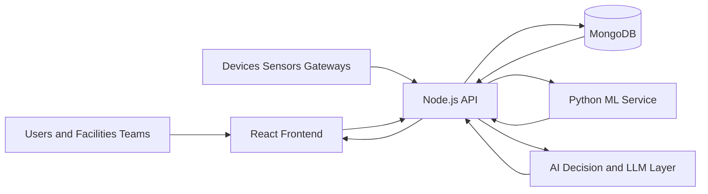

# SustainOS AI


SustainOS AI is a full-stack sustainability operations platform for smart buildings, campuses, enterprises, and public infrastructure. It turns raw water and energy telemetry into alerts, AI explanations, forecasts, incident queues, and an execution-focused Mission Control dashboard so teams can reduce waste instead of just watching charts.

For judges and reviewers using the deployed app, start with [JUDGE_GUIDE.md](JUDGE_GUIDE.md).

## Quick Links

- Judges: [JUDGE_GUIDE.md](JUDGE_GUIDE.md)
- Demo and validation: [Demo](#demo)
- Screenshots: [Screenshots](#screenshots)
- Local setup: [Local Setup](#local-setup)
- Deployment notes: [Deployment](#deployment)

## Judge Snapshot

| Topic | Summary |
| --- | --- |
| Problem | Utility waste is usually discovered late because telemetry, alerts, and action planning live in separate tools. |
| Product | SustainOS AI is an operational sustainability platform, not just a dashboard. |
| Users | Facilities teams, campus operators, smart-building admins, and sustainability leads. |
| Core differentiator | It turns live telemetry into ranked hotspots, alerts, AI guidance, and an execution-ready Mission Control workflow. |
| Technical proof | Full-stack web app, ML microservice, SaaS workspace layer, smoke checks, and seeded end-to-end demo scripts. |

## What SustainOS AI Does

SustainOS AI helps organizations detect utility waste, explain risk, and prioritize action across buildings, campuses, and infrastructure portfolios.

Instead of only visualizing charts, the platform connects telemetry ingestion, anomaly detection, alerts, building ranking, ML forecasting, AI explanations, and workspace controls in one product.

## Problem

Water and energy waste usually stays hidden because operations teams work across scattered dashboards, delayed reports, and reactive maintenance processes. In campuses, hostels, hospitals, offices, and public buildings, this leads to:

- unnoticed leakage and abnormal utility spikes
- delayed incident response
- poor visibility into sensor health
- weak accountability across teams
- hard-to-explain sustainability data for decision makers

## Why This Project Stands Out

- It is execution-focused. Mission Control ranks buildings by risk and savings opportunity instead of stopping at passive analytics.
- It has real product depth. The repo includes auth, roles, invites, API keys, audit logs, and workspace management.
- It supports multiple data-entry paths. Teams can work with manual telemetry, sensors, gateways, and webhook-style ingest.
- It is verifiable. The project includes health checks, test coverage, and a seeded end-to-end demo script that exercises the main product journey.

## Core Capabilities

- Ingests water and energy telemetry through manual entry, sensors, gateways, and webhook-style APIs
- Detects abnormal spikes, likely leakage, peak-load drift, and sensor reliability issues
- Generates alerts, notifications, and incident-ready operational context
- Calculates sustainability score, usage summaries, and efficiency trends
- Forecasts near-term usage with a Python ML microservice
- Provides natural-language AI explanations and guided next actions
- Ranks hotspots in a Mission Control dashboard with savings and risk context
- Tracks sensors, low-battery devices, weak signal quality, and telemetry health
- Supports SaaS workspace operations with roles, invites, plans, API keys, and audit logs

## Recommended Judge Flow

If a judge wants the fastest understanding path, this is the best sequence:

1. Dashboard
2. Mission Control / Recommendations
3. Alerts
4. Sensors
5. Workspace
6. Analytics
7. AI Copilot

This flow is expanded in [JUDGE_GUIDE.md](JUDGE_GUIDE.md).

## Why It Matters

SustainOS AI is designed for real-world operators, not just analysts.

Best-fit environments:

- smart campuses and universities
- hostels and residential blocks
- hospitals and healthcare facilities
- corporate offices and commercial buildings
- smart city and municipal monitoring pilots
- sustainability consulting and operations command centers

## Hackathon Pitch

SustainOS AI is a sustainability operations SaaS platform that helps organizations detect utility waste, prioritize incidents, and act faster using AI and real-time telemetry. Instead of only showing dashboards, it tells teams what is wrong, where it is happening, why it matters, and what to do next.

## Product Highlights

### 1. Mission Control

The Mission Control layer ranks buildings by risk and opportunity, then translates telemetry into an execution plan.

- hotspot ranking
- issue classification
- savings opportunity
- carbon and water recovery estimation
- team-level queueing
- execution roadmap for today, this week, and this month

### 2. AI Copilot

The AI layer helps users understand the state of operations in natural language.

- contextual Q&A
- forecast explanation
- live-data-aware responses
- fallback logic when external LLMs are unavailable
- support for local Ollama and optional OpenAI or Gemini

### 3. SaaS Workspace

SustainOS AI includes a real workspace layer so teams can manage access, integrations, and operations in a production-style SaaS model.

- isolated workspaces for campuses, companies, and facilities
- role-based access for Owner, Admin, Operator, Analyst, and Viewer
- invite-based onboarding for fast team setup
- plan-aware feature controls for multi-tenant growth
- API key creation and revocation for devices, sensors, and gateways
- audit logs for critical admin and configuration changes

### 4. Sensor and IoT Operations

- sensor registration and heartbeat tracking
- API key-based ingest for devices and gateways
- low battery and weak signal detection
- sensor summary and telemetry confidence view

### 5. Reliability and Runtime Health

- backend liveness and readiness endpoints
- structured error handling
- request-scoped trace IDs
- frontend error boundary
- smoke test scripts for deployment and demo validation

## End-To-End Flow

1. A user creates an account or joins a workspace through an invite.
2. The workspace owner configures organization details, plan, roles, and API access.
3. Telemetry is sent through manual input, sensor endpoints, or gateway APIs.
4. The backend stores the data in MongoDB and syncs sensor heartbeat information.
5. Detection logic evaluates spikes, drift, and anomaly patterns.
6. Alerts and notifications are generated when a risk threshold is crossed.
7. Analytics and score engines summarize operational health.
8. The Python ML service predicts future usage and supports advanced insight generation.
9. Mission Control prioritizes hotspots and recommends next actions.
10. The AI copilot explains what is happening in natural language.

## Architecture



## System Design

### Frontend

- React 19
- Vite 7
- Tailwind CSS
- Recharts and Chart.js
- Socket.IO client
- role-aware protected routes

Core views:

- Dashboard
- Analytics
- Recommendations / Mission Control
- Alerts
- Incidents
- Sensors
- Workspace
- Reports
- Notifications
- Profile and Settings

### Backend

- Node.js
- Express 5
- Mongoose
- Socket.IO
- JWT authentication
- API key authentication for machine ingest

Key API areas:

- auth
- telemetry
- analytics
- alerts
- sensors
- notifications
- AI
- workspace / platform

### ML Service

- Python HTTP service
- anomaly support
- forecasting
- model training
- profile voice parsing

## Repository Structure

```text
project-root/
|-- Client/
|   |-- src/
|   |   |-- components/
|   |   |-- context/
|   |   |-- pages/
|   |   |-- routes/
|   |   `-- utils/
|   |-- package.json
|   `-- vite.config.js
|-- server/
|   |-- ai/
|   |-- config/
|   |-- controllers/
|   |-- middleware/
|   |-- models/
|   |-- routes/
|   |-- services/
|   |-- tests/
|   |-- app.js
|   `-- server.js
|-- ml_service/
|   |-- server.py
|   |-- trainable_model.py
|   |-- profile_voice_model.py
|   |-- requirements.txt
|   `-- .env.example
|-- screenshots/
|-- start-dev.ps1
|-- hackathon-smoke-test.ps1
|-- full-e2e-demo.ps1
|-- JUDGE_GUIDE.md
|-- DEPLOYMENT.md
|-- render.yaml
|-- README.md
`-- LICENSE
```

## Tech Stack

- Frontend: React, Vite, Tailwind CSS, Recharts, Chart.js, Framer Motion
- Backend: Node.js, Express, Mongoose, Socket.IO, JWT
- Database: MongoDB
- ML: Python service
- AI providers: Ollama by default, optional OpenAI and Gemini
- Deployment: Render-ready backend and ML blueprint, static frontend compatible

## Demo

### Judge Note

Put the final public app links in [JUDGE_GUIDE.md](JUDGE_GUIDE.md). Do not share Render dashboard links with judges.

### Public Demo Links

Current deployed links:

- `Live App`: `https://sustaionos-open-source-sustainability-ygcz.onrender.com`
- `Live API Base`: `https://sustaionos-open-source-sustainability-ip3w.onrender.com`
- `Live API Health`: `https://sustaionos-open-source-sustainability-ip3w.onrender.com/api/health`
- `Live ML Health`: `https://sustaionos-open-source-sustainability-do10.onrender.com/health`
- `Demo Video`: [`demo.mp4`](demo.mp4)

### Demo Video

Click the preview below to open the recorded demo walkthrough.

[](demo.mp4)

Direct video file: [demo.mp4](demo.mp4)

### Best Demo Story

Suggested demo flow:

1. Start with the dashboard and problem statement
2. Show live alerts and Mission Control
3. Open Workspace to show SaaS product depth
4. Show Sensors and API-key-based ingestion
5. Show Analytics, ML prediction, and AI copilot
6. End with impact, savings, and real-world use cases

### Built-In Demo Validation

This repo includes two scripts that make demo prep and judging easier:

- `hackathon-smoke-test.ps1`
- `full-e2e-demo.ps1`

Example:

```powershell
.\hackathon-smoke-test.ps1 -FrontendUrl http://127.0.0.1:4173 -BackendUrl http://127.0.0.1:5000 -MlUrl http://127.0.0.1:8000
```

```powershell
.\full-e2e-demo.ps1 -FrontendUrl http://127.0.0.1:4173 -BackendUrl http://127.0.0.1:5000 -MlUrl http://127.0.0.1:8000
```

The seeded demo validates:

- account registration
- workspace profile update
- team invite creation
- API key generation
- sensor registration
- telemetry ingest
- analytics and score
- Mission Control hotspot ranking
- alerts and notifications
- ML training and prediction
- AI forecast and Q&A

## Screenshots

The gallery below follows a product walkthrough from onboarding to operational action, reporting, and workspace management. Every image is sourced from the current `screenshots/` folder.

<table>
  <tr>
    <td align="center" width="50%">
      
      <br />
      <strong>1. Register Account</strong>
    </td>
    <td align="center" width="50%">
      
      <br />
      <strong>2. Login</strong>
    </td>
  </tr>
  <tr>
    <td align="center" width="50%">
      
      <br />
      <strong>3. Dashboard Overview</strong>
    </td>
    <td align="center" width="50%">
      
      <br />
      <strong>4. Location Overview</strong>
    </td>
  </tr>
  <tr>
    <td align="center" width="50%">
      
      <br />
      <strong>5. Building Comparison</strong>
    </td>
    <td align="center" width="50%">
      
      <br />
      <strong>6. Mission Control Recommendations</strong>
    </td>
  </tr>
  <tr>
    <td align="center" width="50%">
      
      <br />
      <strong>7. Alert Center</strong>
    </td>
    <td align="center" width="50%">
      
      <br />
      <strong>8. Incident Workflow</strong>
    </td>
  </tr>
  <tr>
    <td align="center" width="50%">
      
      <br />
      <strong>9. IoT Sensor Network</strong>
    </td>
    <td align="center" width="50%">
      
      <br />
      <strong>10. Usage History</strong>
    </td>
  </tr>
  <tr>
    <td align="center" width="50%">
      
      <br />
      <strong>11. Analytics and Insights</strong>
    </td>
    <td align="center" width="50%">
      
      <br />
      <strong>12. Impact Summary</strong>
    </td>
  </tr>
  <tr>
    <td align="center" width="50%">
      
      <br />
      <strong>13. Sustainability Reports</strong>
    </td>
    <td align="center" width="50%">
      
      <br />
      <strong>14. AI Assistant</strong>
    </td>
  </tr>
  <tr>
    <td align="center" width="50%">
      
      <br />
      <strong>15. Workspace Console</strong>
    </td>
    <td align="center" width="50%">
      
      <br />
      <strong>16. Profile Overview</strong>
    </td>
  </tr>
  <tr>
    <td align="center" width="50%">
      
      <br />
      <strong>17. Account Settings</strong>
    </td>
    <td align="center" width="50%">
    </td>
  </tr>
</table>

## Local Setup

### Prerequisites

- Node.js `20.19+`
- Python `3.10+`
- MongoDB connection string
- Optional Ollama for local AI mode

### 1. Clone and install

```powershell
git clone <your-repo-url>
cd SustaionOS-open-source-sustainability-monitoring-action-app

cd server
npm install

cd ..\Client
npm install

cd ..\ml_service
pip install -r requirements.txt

cd ..
```

### 2. Configure environment files

Copy these files and fill values:

- `server/.env.example`
- `Client/.env.example`
- `ml_service/.env.example`

Minimum local values to check first:

- `server/.env`: `MONGO_URI`, `JWT_SECRET`, `CLIENT_ORIGIN`, `AI_PROVIDER`, `ML_SERVICE_URL`
- `Client/.env`: `VITE_API_URL`, `VITE_SOCKET_URL`
- `ml_service/.env`: `HOST`, `PORT`

Recommended local defaults:

- `CLIENT_ORIGIN=http://localhost:5173`
- `VITE_API_URL=http://localhost:5000`
- `VITE_SOCKET_URL=http://localhost:5000`
- `ML_SERVICE_URL=http://localhost:8000`

### 3. Start the stack

Fastest local start:

```powershell
.\start-dev.ps1
```

Manual start:

```powershell
python ml_service/server.py
```

```powershell
cd server
npm run dev
```

```powershell
cd Client
npm run dev
```

### 4. Optional local AI mode

```powershell
ollama pull llama3.2:1b
ollama serve
```

If you do not want external providers during judging, keep:

- `OPENAI_API_KEY=` empty
- `GEMINI_API_KEY=` empty
- `AI_PROVIDER=ollama` or use the local fallback mode

## Deployment

This repository includes a Render blueprint in `render.yaml` for the backend and ML services.

Recommended production layout:

- Frontend: Vercel, Netlify, or any static host
- Backend: Render
- ML service: Render
- Database: MongoDB Atlas
- Optional LLM: self-hosted Ollama or provider-based integration

For public judge links, update [JUDGE_GUIDE.md](JUDGE_GUIDE.md).

See [DEPLOYMENT.md](DEPLOYMENT.md) for deployment detail.

## Verification

Verified flows in the project:

- frontend production build
- backend tests
- lint checks
- runtime health checks
- seeded end-to-end demo flow

Useful commands:

```powershell
cd Client
npm run lint
npm run build
```

```powershell
cd server
npm test
```

```powershell
.\hackathon-smoke-test.ps1 -FrontendUrl http://127.0.0.1:4173 -BackendUrl http://127.0.0.1:5000 -MlUrl http://127.0.0.1:8000
```

## Real-World Readiness

Current strengths:

- strong hackathon demo value
- real operational problem solving
- full-stack product depth
- SaaS workspace model
- API-key-based machine ingest
- alerting, analytics, forecasting, and AI in one system

Best-fit environments:

- smart campuses
- educational institutions
- hostels and residential infrastructure
- enterprise utility operations
- early-stage smart city and public infrastructure pilots

## Future Expansion

Potential next upgrades for commercial growth:

- billing and subscriptions
- SSO and enterprise identity
- email and messaging workflows
- job queues and retry pipelines
- deeper observability and analytics
- multi-tenant enterprise controls
- mobile field operations support

## Team

Built by Team ByteCoder.

Contributors:

- Gautam Sagar
- Gaurav Gautam
- Manjeet Varun
- Sumit Mathur

## License

This project is licensed under the MIT License. See [LICENSE](LICENSE).
